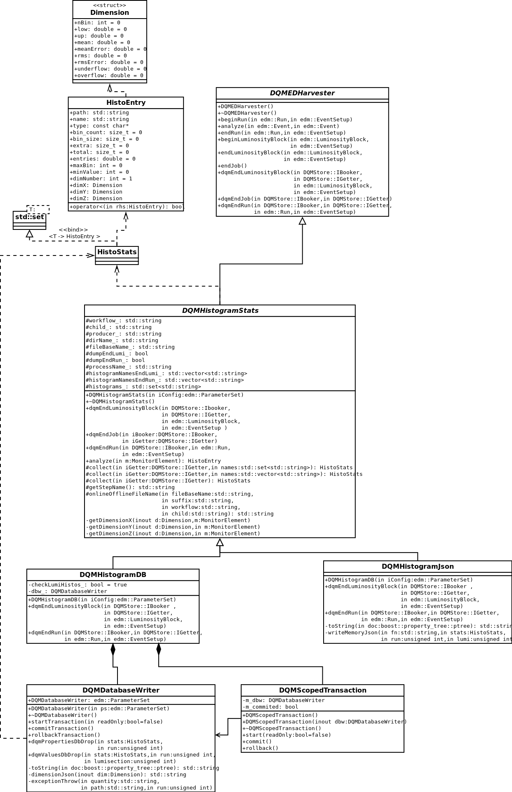

## Histogram stats writer
The modules of Histogram stats allows to write properties of specific histograms to json files or database.
### About
The modules of Histogram stats allows to collect specific histograms in the end of each  lumisection and in the end of each run and save them in the json files or database.
The query-database allows to select histograms from database and make the plots of properties.

### Design
The application modules are:
* HistoStats - a data type for storing histogram properties.
* DQMHistogramStats - module, which inherits DQMEDHarvester, used to collect all the histograms.
* DQMHistogramJson - module, which inherits DQMHistogramStats, used to output the histogram properties into json files.
* DQMHistogramDB - module which inherits DQMHistogramStats and uses DQMDatabaseWriter to write histogram properties into the database.
* DQMDatabaseWriter - module used to work with database.
* DQMHistogramTest - module creating custom histograms and storing them into DQMStore.
* DQMHistogramTest_cfg - config file used to run DQMHistogramTest and save these histograms into json files or database.
* cmsdqm_initDB - used to create sqlite database.

UML class diagram is attached at the end.

### Workflow
To run database writer or json writer they have to be included in the specific step of the matrix in which the histograms are stored. To specify the histograms we want to store, we need to edit DQMHistogramDB_cfg or DQMHistogramJson_cfg file by specifying the histograms. 
By using wildcard * in the histogramNames parameters all the histograms will be selected.

### DQMDatabaseWriter
DQMDatabaseWriter stores the data into three tables: Histogram, Histogram_props, Histogram_values. To store the data in Histogram and Histogram_props tables it checks first whether the histogram does not already exit in "Histogram" table. If not it saves properties into these two tables, otherwise it checks the Histogram_props for primary key existance and only then stores.
To store values into Histogram_values it checks for the primary key and if it exists throws an exception otherwise writes. 
For both of these cases the scoped transactions are used that means if unexpected exception happens or the process crashes all the data will be rollbacked.

### query-database usage
This module visualizes the histograms the user wants to check.
The script allows to select histograms by path, run number, lumisections, minimum number of lumisection and maximum number of lumisection.

usage: query_database.py [-h] [-d DATABASE] [-r RUN] [-l LUMINOSITY] 
&nbsp;&nbsp;&nbsp;&nbsp;&nbsp;&nbsp;&nbsp;&nbsp;&nbsp;&nbsp;&nbsp;&nbsp;&nbsp;&nbsp;&nbsp;&nbsp;&nbsp;&nbsp;&nbsp;&nbsp;&nbsp;&nbsp;&nbsp;&nbsp;&nbsp;&nbsp;&nbsp;&nbsp;&nbsp;&nbsp;&nbsp;&nbsp;&nbsp;&nbsp;&nbsp;&nbsp;&nbsp;&nbsp;&nbsp;&nbsp;&nbsp;&nbsp;&nbsp;&nbsp;&nbsp;&nbsp;&nbsp;&nbsp;&nbsp;&nbsp;&nbsp;&nbsp;[-min MINLUMINOSITY] [-max MAXLUMINOSITY] 
&nbsp;&nbsp;&nbsp;&nbsp;&nbsp;&nbsp;&nbsp;&nbsp;&nbsp;&nbsp;&nbsp;&nbsp;&nbsp;&nbsp;&nbsp;&nbsp;&nbsp;&nbsp;&nbsp;&nbsp;&nbsp;&nbsp;&nbsp;&nbsp;&nbsp;&nbsp;&nbsp;&nbsp;&nbsp;&nbsp;&nbsp;&nbsp;&nbsp;&nbsp;&nbsp;&nbsp;&nbsp;&nbsp;&nbsp;&nbsp;&nbsp;&nbsp;&nbsp;&nbsp;&nbsp;&nbsp;&nbsp;&nbsp;&nbsp;&nbsp;&nbsp;&nbsp;[-p PATH]

Arguments: 
&nbsp;&nbsp;&nbsp;&nbsp;&nbsp;&nbsp;-h, --help            show this help message and exit 
&nbsp;&nbsp;&nbsp;&nbsp;&nbsp;&nbsp;-d DEFAULT, --default DEFAULT 
&nbsp;&nbsp;&nbsp;&nbsp;&nbsp;&nbsp;&nbsp;&nbsp;&nbsp;&nbsp;&nbsp;&nbsp;&nbsp;&nbsp;&nbsp;&nbsp;&nbsp;&nbsp;&nbsp;&nbsp;&nbsp;&nbsp;&nbsp;&nbsp;&nbsp;&nbsp;&nbsp;&nbsp;&nbsp;&nbsp;&nbsp;&nbsp;&nbsp;&nbsp;&nbsp;&nbsp;&nbsp;&nbsp;&nbsp;&nbsp;&nbsp;&nbsp;&nbsp;Use default database. Otherwise uses oracle database with .netrc configuration 
&nbsp;&nbsp;&nbsp;&nbsp;&nbsp;&nbsp;-p PATH, --path PATH 
&nbsp;&nbsp;&nbsp;&nbsp;&nbsp;&nbsp;&nbsp;&nbsp;&nbsp;&nbsp;&nbsp;&nbsp;&nbsp;&nbsp;&nbsp;&nbsp;&nbsp;&nbsp;&nbsp;&nbsp;&nbsp;&nbsp;&nbsp;&nbsp;&nbsp;&nbsp;&nbsp;&nbsp;&nbsp;&nbsp;&nbsp;&nbsp;&nbsp;&nbsp;&nbsp;&nbsp;&nbsp;&nbsp;&nbsp;&nbsp;&nbsp;&nbsp;&nbsp;specify histogram path for SQL query, if you also 
&nbsp;&nbsp;&nbsp;&nbsp;&nbsp;&nbsp;&nbsp;&nbsp;&nbsp;&nbsp;&nbsp;&nbsp;&nbsp;&nbsp;&nbsp;&nbsp;&nbsp;&nbsp;&nbsp;&nbsp;&nbsp;&nbsp;&nbsp;&nbsp;&nbsp;&nbsp;&nbsp;&nbsp;&nbsp;&nbsp;&nbsp;&nbsp;&nbsp;&nbsp;&nbsp;&nbsp;&nbsp;&nbsp;&nbsp;&nbsp;&nbsp;&nbsp;&nbsp;specify run (but no luminosity), program will display 
&nbsp;&nbsp;&nbsp;&nbsp;&nbsp;&nbsp;&nbsp;&nbsp;&nbsp;&nbsp;&nbsp;&nbsp;&nbsp;&nbsp;&nbsp;&nbsp;&nbsp;&nbsp;&nbsp;&nbsp;&nbsp;&nbsp;&nbsp;&nbsp;&nbsp;&nbsp;&nbsp;&nbsp;&nbsp;&nbsp;&nbsp;&nbsp;&nbsp;&nbsp;&nbsp;&nbsp;&nbsp;&nbsp;&nbsp;&nbsp;&nbsp;&nbsp;&nbsp;plots of histogram properties vs luminosities 
&nbsp;&nbsp;&nbsp;&nbsp;&nbsp;&nbsp;-r RUN, --run RUN 
&nbsp;&nbsp;&nbsp;&nbsp;&nbsp;&nbsp;&nbsp;&nbsp;&nbsp;&nbsp;&nbsp;&nbsp;&nbsp;&nbsp;&nbsp;&nbsp;&nbsp;&nbsp;&nbsp;&nbsp;&nbsp;&nbsp;&nbsp;&nbsp;&nbsp;&nbsp;&nbsp;&nbsp;&nbsp;&nbsp;&nbsp;&nbsp;&nbsp;&nbsp;&nbsp;&nbsp;&nbsp;&nbsp;&nbsp;&nbsp;&nbsp;&nbsp;&nbsp;specify run number for SQL query 
&nbsp;&nbsp;&nbsp;&nbsp;&nbsp;&nbsp;-l LUMINOSITY, --luminosity LUMINOSITY 
&nbsp;&nbsp;&nbsp;&nbsp;&nbsp;&nbsp;&nbsp;&nbsp;&nbsp;&nbsp;&nbsp;&nbsp;&nbsp;&nbsp;&nbsp;&nbsp;&nbsp;&nbsp;&nbsp;&nbsp;&nbsp;&nbsp;&nbsp;&nbsp;&nbsp;&nbsp;&nbsp;&nbsp;&nbsp;&nbsp;&nbsp;&nbsp;&nbsp;&nbsp;&nbsp;&nbsp;&nbsp;&nbsp;&nbsp;&nbsp;&nbsp;&nbsp;&nbsp;specify luminosity number for SQL query 
&nbsp;&nbsp;&nbsp;&nbsp;&nbsp;&nbsp;-min MINLUMINOSITY, --minLuminosity MINLUMINOSITY 
&nbsp;&nbsp;&nbsp;&nbsp;&nbsp;&nbsp;&nbsp;&nbsp;&nbsp;&nbsp;&nbsp;&nbsp;&nbsp;&nbsp;&nbsp;&nbsp;&nbsp;&nbsp;&nbsp;&nbsp;&nbsp;&nbsp;&nbsp;&nbsp;&nbsp;&nbsp;&nbsp;&nbsp;&nbsp;&nbsp;&nbsp;&nbsp;&nbsp;&nbsp;&nbsp;&nbsp;&nbsp;&nbsp;&nbsp;&nbsp;&nbsp;&nbsp;&nbsp;specify min luminosity number for SQL query 
&nbsp;&nbsp;&nbsp;&nbsp;&nbsp;&nbsp;-max MAXLUMINOSITY, --maxLuminosity MAXLUMINOSITY 
&nbsp;&nbsp;&nbsp;&nbsp;&nbsp;&nbsp;&nbsp;&nbsp;&nbsp;&nbsp;&nbsp;&nbsp;&nbsp;&nbsp;&nbsp;&nbsp;&nbsp;&nbsp;&nbsp;&nbsp;&nbsp;&nbsp;&nbsp;&nbsp;&nbsp;&nbsp;&nbsp;&nbsp;&nbsp;&nbsp;&nbsp;&nbsp;&nbsp;&nbsp;&nbsp;&nbsp;&nbsp;&nbsp;&nbsp;&nbsp;&nbsp;&nbsp;&nbsp;specify max luminosity number for SQL query 
&nbsp;&nbsp;&nbsp;&nbsp;&nbsp;&nbsp;-p PATH, --path PATH 
&nbsp;&nbsp;&nbsp;&nbsp;&nbsp;&nbsp;&nbsp;&nbsp;&nbsp;&nbsp;&nbsp;&nbsp;&nbsp;&nbsp;&nbsp;&nbsp;&nbsp;&nbsp;&nbsp;&nbsp;&nbsp;&nbsp;&nbsp;&nbsp;&nbsp;&nbsp;&nbsp;&nbsp;&nbsp;&nbsp;&nbsp;&nbsp;&nbsp;&nbsp;&nbsp;&nbsp;&nbsp;&nbsp;&nbsp;&nbsp;&nbsp;&nbsp;&nbsp;specify histogram path for SQL query, if you also 
&nbsp;&nbsp;&nbsp;&nbsp;&nbsp;&nbsp;&nbsp;&nbsp;&nbsp;&nbsp;&nbsp;&nbsp;&nbsp;&nbsp;&nbsp;&nbsp;&nbsp;&nbsp;&nbsp;&nbsp;&nbsp;&nbsp;&nbsp;&nbsp;&nbsp;&nbsp;&nbsp;&nbsp;&nbsp;&nbsp;&nbsp;&nbsp;&nbsp;&nbsp;&nbsp;&nbsp;&nbsp;&nbsp;&nbsp;&nbsp;&nbsp;&nbsp;&nbsp;specify run (but no luminosity), program will display 
&nbsp;&nbsp;&nbsp;&nbsp;&nbsp;&nbsp;&nbsp;&nbsp;&nbsp;&nbsp;&nbsp;&nbsp;&nbsp;&nbsp;&nbsp;&nbsp;&nbsp;&nbsp;&nbsp;&nbsp;&nbsp;&nbsp;&nbsp;&nbsp;&nbsp;&nbsp;&nbsp;&nbsp;&nbsp;&nbsp;&nbsp;&nbsp;&nbsp;&nbsp;&nbsp;&nbsp;&nbsp;&nbsp;&nbsp;&nbsp;&nbsp;&nbsp;&nbsp;plots of histogram properties vs luminosities 

### Implemented tests
There is automated test: python/test/run_JsonDB_test.sh. 
The steps of test:
* Creates histograms in DQMStore and runs included module in it which stores histograms properties into json files and database.
* Check with check_file_JsonDB.py the values of histograms.
* Harvests the root file with harv_fileJsonDB_cfg.py.
* Compares Json file to root file and to database.

### UML class diagram

