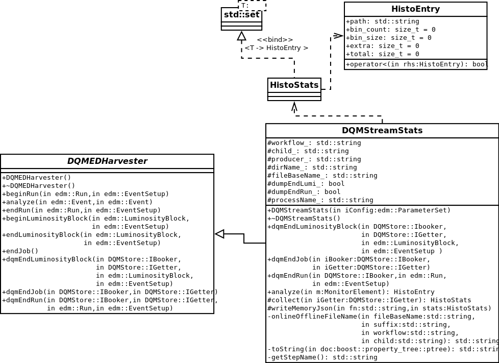

## Memory profiling application
Web application to show histograms memory sizes.
### About
The web application shows the usage of memory in bytes and percentage of all
histogram paths which were collected by running the specific matrix. The application uses the histogram properties collected by the end of lumisections and by the end of runs. It also shows the comparison of histograms between 2 selected files.

### Design

The application modules are:
* HistoStats - a data type for storing histogram properties.
* DQMStreamStats - a module to collect all the histograms and store them as json files.
* dqm-profile - a script to run the matrix with customized command and copy all the needed files to web page directory.
* customize_DQMStreamStats - configuration file to add DQMStreamStats module to the runTheMatrix command.
* mbGraph.html, mbGraph.js, memoryGraph.js - Web application files which are copied to new created directory.

UML class diagram is attached at the end.

### Workflow

The process starts in dqm-profile.py script command.

* The script runs the runTheMatrix command with the passed number of matrix and with customization of DQMStreamStats module included.

* The DQMStreamStats at the end of each lumisection and each run collects the sizes of all histograms and stores them in json format.

* Then, the script transfers all the json files and web-page files to another directory which is now ready to show visualized memory usage of the histograms.

### dqm-profile usage

The example command: python dqm-profile.py runTheMatrix.py -l 25.0 
will runTheMatrix 25.0 with customized command and will create a default directory memory with the web page and json files in it.

positional arguments: 
&nbsp;&nbsp;&nbsp;&nbsp;&nbsp;&nbsp;pargs : -l [number] - Number of the matrix

optional arguments: 
&nbsp;&nbsp;&nbsp;&nbsp;&nbsp;&nbsp;-h, --help            show this help message and exit 
&nbsp;&nbsp;&nbsp;&nbsp;&nbsp;&nbsp;-f memory, --folder memory 
&nbsp;&nbsp;&nbsp;&nbsp;&nbsp;&nbsp;&nbsp;&nbsp;&nbsp;&nbsp;&nbsp;&nbsp;&nbsp;&nbsp;&nbsp;&nbsp;&nbsp;&nbsp;&nbsp;&nbsp;&nbsp;&nbsp;&nbsp;&nbsp;&nbsp;&nbsp;&nbsp;&nbsp;&nbsp;&nbsp;&nbsp;&nbsp;&nbsp;&nbsp;&nbsp;&nbsp;&nbsp;&nbsp;&nbsp;&nbsp;&nbsp;&nbsp;&nbsp;Folder name of the web page directory. 
&nbsp;&nbsp;&nbsp;&nbsp;&nbsp;&nbsp;-q                    Reduce logging. 
&nbsp;&nbsp;&nbsp;&nbsp;&nbsp;&nbsp;-src SOURCE, --source SOURCE 
&nbsp;&nbsp;&nbsp;&nbsp;&nbsp;&nbsp;&nbsp;&nbsp;&nbsp;&nbsp;&nbsp;&nbsp;&nbsp;&nbsp;&nbsp;&nbsp;&nbsp;&nbsp;&nbsp;&nbsp;&nbsp;&nbsp;&nbsp;&nbsp;&nbsp;&nbsp;&nbsp;&nbsp;&nbsp;&nbsp;&nbsp;&nbsp;&nbsp;&nbsp;&nbsp;&nbsp;&nbsp;&nbsp;&nbsp;&nbsp;&nbsp;&nbsp;&nbsp;&nbsp;&nbsp;&nbsp;&nbsp;&nbsp;&nbsp;Source folder path of the already existing matrix directory. 

### UML class diagram

### Web page usage
To choose the jsons files in web page there are url parameters 'profile' and 'reference' which loads the files. 
To show the the histograms size of one file choose the 'profile' or 'reference' element in options list.  
To see the comparison of the files choose 'difference profile' or 'diffrence reference'. 
The comparison is done by substracting the values of each histogram.
Considering profile is A and reference is B. 
All the histograms showed in difference A meets this rule Ha - Hb > 0. 
In difference B: Hb - Ha > 0. 
If the minuend histogram doesn't exit, is considered as 0. 
To mark the specific folder the user can click on it and save url with the marked path. 
